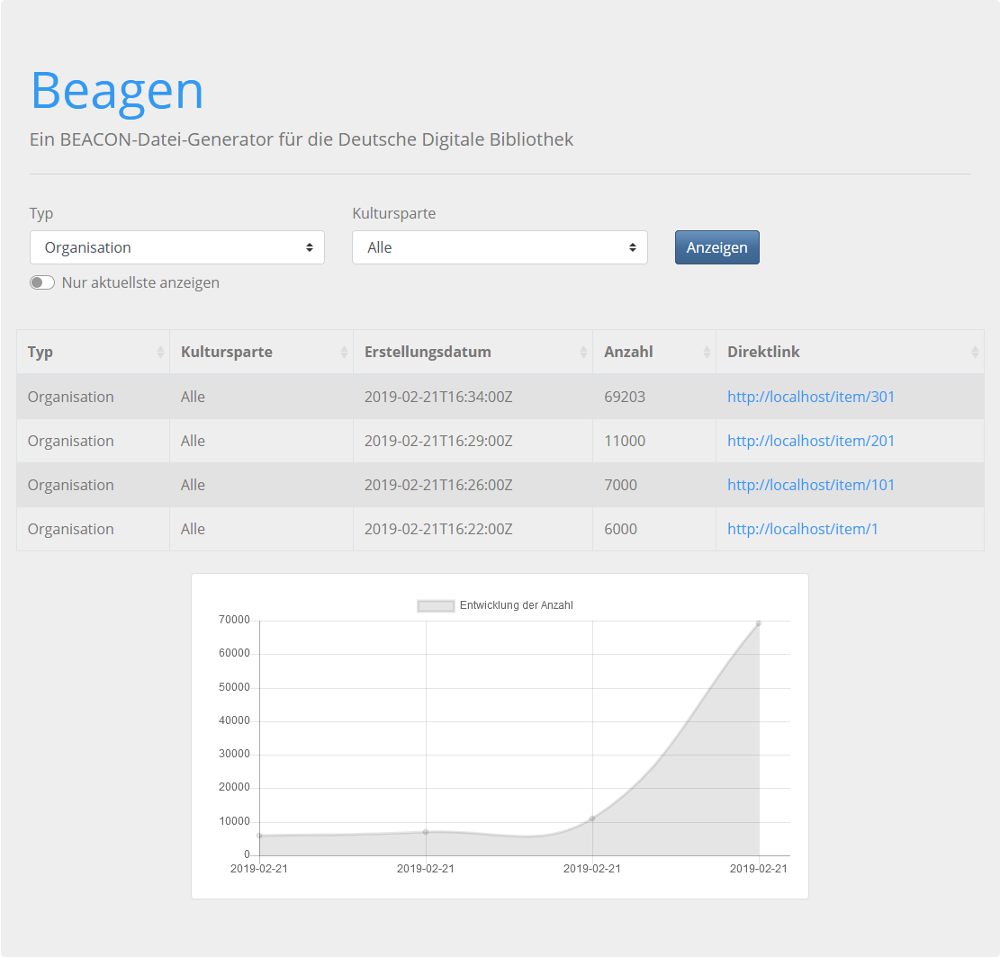

# Beagen: A BEACON file generator for Deutsche Digitale Bibliothek
A [BEACON file](http://gbv.github.io/beaconspec/beacon.html) generator for the [Deutsche Digitale Bibliothek](https://www.deutsche-digitale-bibliothek.de/). It's a maven project comming with [Jetty web server](http://www.eclipse.org/jetty/).

- GitHub: https://github.com/Deutsche-Digitale-Bibliothek/ddblabs-beagen
- Docker: https://hub.docker.com/r/ddblabs/beagen/

| GitHub Repository | Docker Tag Name         |
|:-----------------:|:-----------------------:|
| `develop`         | `ddblabs/beagen:latest` |
| `master`          | `ddblabs/beagen:stable` |

## Screenshot


## Docker (Docker Hub registry)
Pull `Beagen` from Docker Hub registry:
```
docker pull ddblabs/beagen
```
Start container:
```
docker run -p 80:80 beagen:stable
```
That's it!

## Docker (local)
This package is a [Docker](https://www.docker.com/) containter. To build the Docker containter run within the direcory with `pom.xml`, `Dockerfile` etc.
```
docker build -t beagen .
```
Next step is to start the container. Jetty within the container will listen on port 80. If the containers outside port shall be 80 too, run:
```
docker run -p 80:80 -it beagen beagen
```

## Maven
To build this project locally without using Docker run within the direcory with `pom.xml`:
```
mvn clean package
```
... to run the Jetty webserver:
```
mvn exec:java
```
The webserver will run locally under: http://127.0.0.1/
